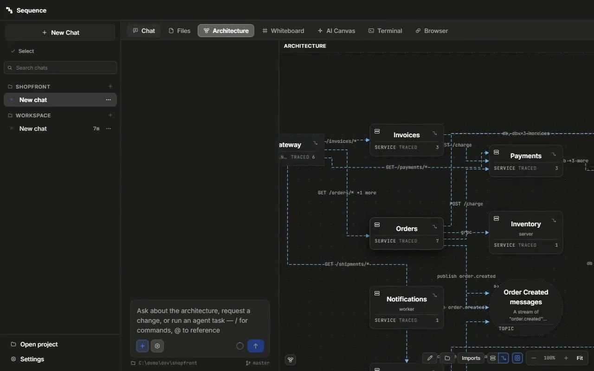
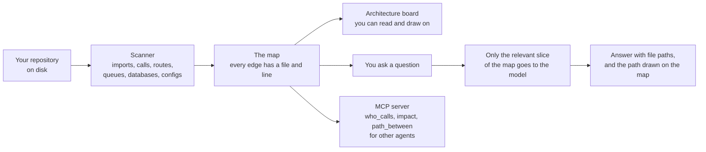

# Sequence

Sequence reads a codebase and draws its architecture: the services, the files, the databases, and the
lines between them. Then you can ask it questions, and it answers from that map instead of from a
model's guess. It runs on your own machine, free, with a local model or one you connect.

[](report/media/sequence-full.mp4)

[Watch the demo](report/media/sequence-full.mp4) (72 s: attach a repository, watch the map get built, then ask it something) · [Download for Windows or macOS](https://trysequence.app/#download) · [How it was measured](report/README.md)

---

## Why I built it

Ask a coding assistant how your system fits together and you usually get a confident answer. Some
of it is right. Some of it describes a system that looks like yours but isn't. The answer reads the
same either way, so you can't tell which parts to trust without checking all of it yourself.

The usual fix is to paste more code into the model. That gets expensive fast, and on a big repository
the file that matters is often not in the window at all.

Sequence takes a different route. It reads the code first, with ordinary static analysis and no model
involved, and builds a map. Every line on that map points at the file and line that proves it. The
model is then given the part of the map that matters for your question, so it works from evidence it
can cite rather than from memory.

## How it works



1. **Scan.** The scanner parses the repository: imports, function calls, HTTP routes and the clients
   that call them, gRPC, queues, database access, Docker Compose, Kubernetes and Helm. It works
   across languages, so a TypeScript gateway calling a Python service is one line on the map.
2. **Map.** Each edge keeps its evidence: the file, the line and the snippet. An edge that only a
   config file claims is drawn dashed until the code confirms it.
3. **Ask.** When you ask something, Sequence picks the part of the map your question is about and
   hands only that to the model, with a few relevant files. The answer names the files it used.
4. **Show.** The answer's path is drawn on the map, so you can check it with your eyes instead of
   taking the text's word for it.

Other agents can use the same map. Sequence ships an MCP server with `who_calls`, `impact` and
`path_between`, so Codex, Claude Code or your own agent can ask the map the same questions.

## What that buys you

**Answers you can check.** Every claim points at a file and a line, and the coverage line under each
answer says how much of the map it actually drew on.

**A flat cost, however big the codebase is.** Pasting source into a model costs more the more you
paste. Sequence sends the same small slice every time:


On this repository, reading every file that mentions a question's words would cost 4.9 million
tokens. Sequence answers the same question from 1,887.

**A better small agent.** We gave the same local agent (a 4B model on an 8 GB card) 36 architecture
questions with hand-checked answers, once with plain shell tools and once with the map added. Nothing
else changed.


Accuracy went from 0.09 to 0.21, and both runs with the map beat both runs without it. The map's
biggest help was on "what breaks if I change this file": 0.02 without it, 0.19 with it. It does
cost more: the agent with the map kept working where the plain agent gave up after one command, so
it used about four times the tokens.

**Answers that got better as we tuned them.** Each change below was kept only if it beat the one
before on the same sealed questions:


**Local and private.** It binds to `127.0.0.1`. Your code does not leave the machine unless you
connect a cloud model yourself.

## How it compares

Other projects have added code graphs to agents too. The published results line up with ours:

| Approach | What happened | Source |
|---|---|---|
| Keyword search alone (BM25) | Finds a file the fix touched in its top 5 on about 62% of SWE-bench Lite issues | LocAgent, ACL 2025 |
| Keyword search plus a repository graph | About 5.6 points better at finding the right file | RepoGraph, ICLR 2025 |
| A code graph served over MCP to a large model | Fewer tokens, slightly lower answer quality than plain file reading | Codebase-Memory (preprint, 2026) |
| Sequence's map given to a small local agent | Accuracy 0.09 to 0.21, more tokens | [our report](report/README.md#6-the-same-agent-with-and-without-sequence) |

Two honest takeaways. A map helps most as an addition to search, not a replacement for it. And
Sequence's own file picker is still weak: replayed over 344 real commits, it put a file the fix
touched in its top five only 3% to 9% of the time, where plain grep managed 22% to 64%. It matches
words against file names but not file contents, and that is the next fix.


## How it's set up

- **Model.** Any OpenAI-compatible endpoint. By default that is a small model in Ollama on your own
  machine, which is how every number above was measured. You can point it at a cloud model instead.
- **No key needed for the map.** Scanning, the board, the whiteboard, drawing, impact and risk
  analysis, and export all run without any model.
- **Teach mode.** Ask it to teach you part of your own repository and it explains one idea at a
  time, draws the chart from the scanned code, and asks you a question about it. The walkthrough is
  in [`docs/journeys/teach-mode.md`](docs/journeys/teach-mode.md).

## Download

Get the installer from [trysequence.app](https://trysequence.app/#download) or the
[releases page](../../releases): Windows (installer or portable zip) and macOS (Apple silicon or
Intel). Each build was downloaded and launched on a fresh machine before release.

The builds aren't signed yet, so your system will warn you the first time:

| | What you'll see | What to do |
|---|---|---|
| **macOS** | "Apple could not verify Sequence is free of malware" | Open it once, then go to **System Settings → Privacy & Security** and press **Open Anyway**. |
| **Windows** | "Windows protected your PC" | Click **More info**, then **Run anyway**. |

If you'd rather not click past a warning, build it from source below. It's the same program.

## Run from source

You need Node 20 or newer and git.

```bash
git clone https://github.com/naidx0/sequence-arch-tool sequence
cd sequence
./start.sh                      # on Windows: .\start.ps1
./start.sh /path/to/your/repo   # or scan a repository straight away
```

It installs, builds and opens the app in your browser at `127.0.0.1`. Pick a repository, open
**Architecture** to see the map, and ask a question in **Chat**. `Ctrl+C` stops it.

## What it isn't

- Not a cloud service. There is nothing to sign in to.
- Not an agent that ships code on its own. It reads, explains, draws and proposes. You decide.
- Not finished. The [report](report/README.md) lists what works, what didn't, and what's next.

## About this repository

This public copy is built from the private working repository, one commit per release, by
`tools/release/mirror.mjs`. That script refuses to publish if a personal path, machine name or
anything shaped like a key would end up in the tree. `CHANGELOG.md` lists what each release changed.

Licence: [`LICENSE`](LICENSE). Third-party notices: [`docs/THIRD-PARTY-NOTICES.md`](docs/THIRD-PARTY-NOTICES.md).
