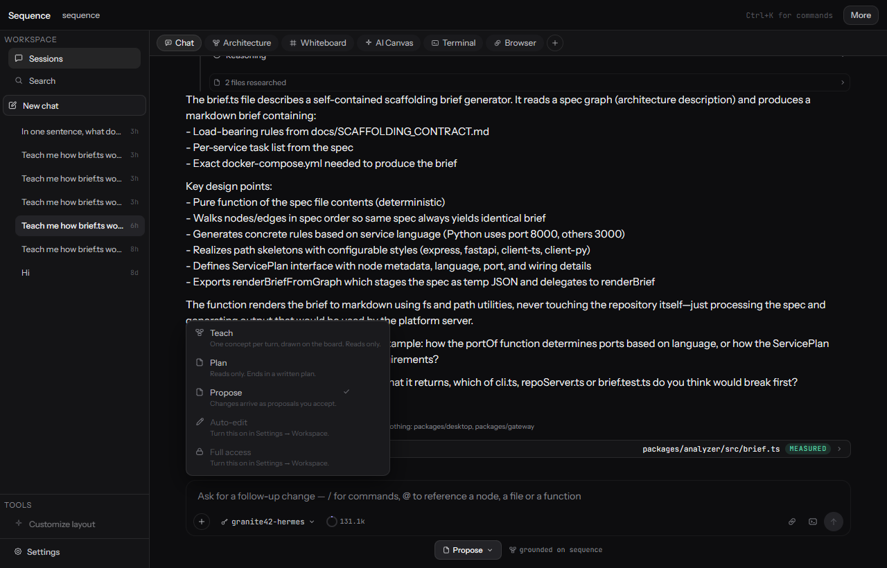
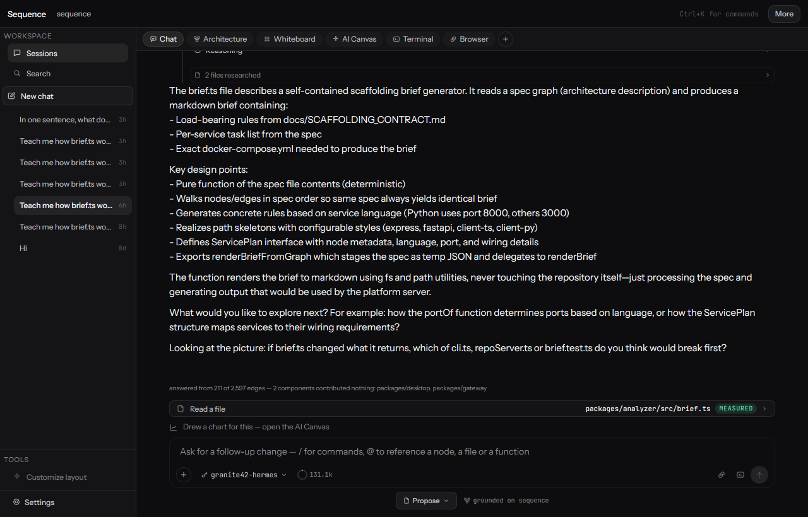
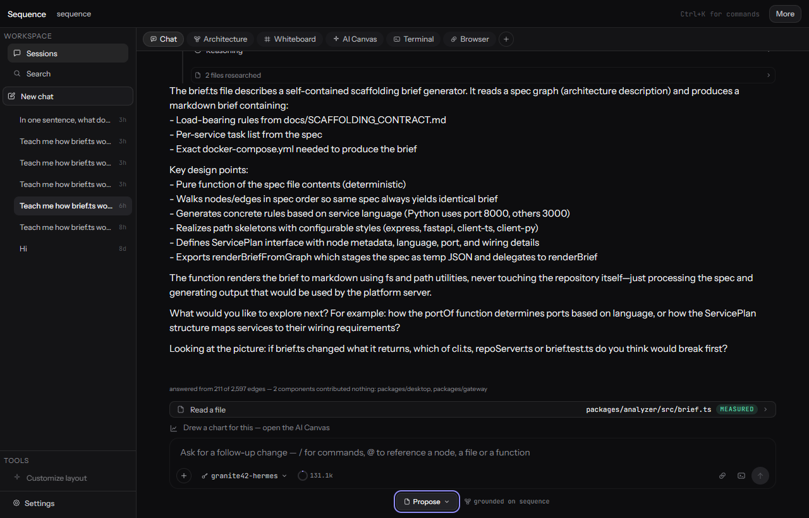
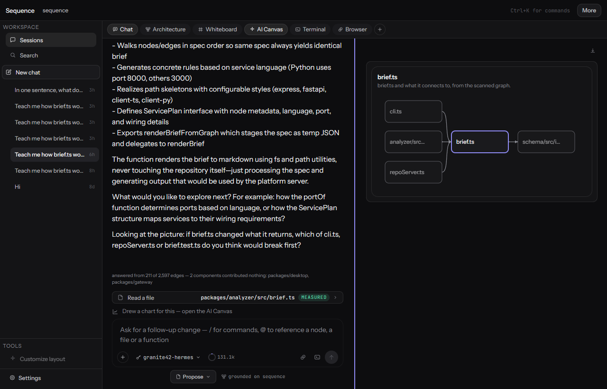
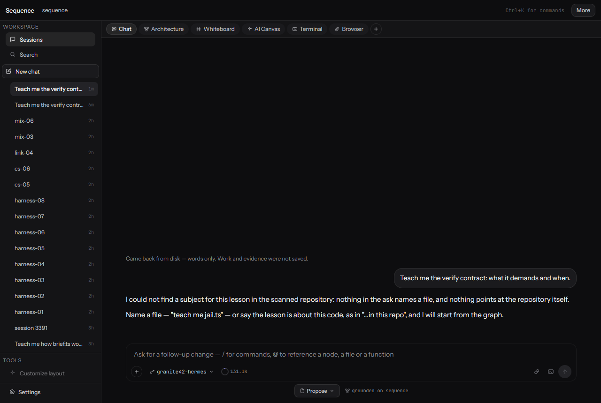

# Teach mode, as a person uses it today

**Captured 2026-09-05 from the running app on `localhost:4173`, viewport 1280×820, build
`startedAt 20:39:31Z / builtAt 20:34:07Z`. Every screen below was looked at. Nothing here is
described from the code.**

**On the captures:** the screens are files, produced by the repository rather than by hand —
`node tools/ci/capture-journey.mjs 4173` drives the running app with the same headless Chromium the
e2e suite uses, reopens a lesson already on disk, and writes them. **It makes no model call**: the
lesson was taught earlier and its chart is persisted.

`docs/journeys/img/capture.json` records which build the screens came from — `startedAt`, `builtAt`
and the commit — because a screenshot with no build behind it is the same claim the stale-server
check exists to stop. The tool refuses to capture from a stale server, which it did on its first
run.

---

## Step 1 — starting a lesson

A person opens Sequence with a repository attached and types into the composer at the bottom. The
control under the box reads **`Propose`**. Clicking it opens one menu, five rows:

| row | its own words |
|---|---|
| **Teach** | *"One concept per turn, drawn on the board. Reads only."* |
| Plan | *"Read-only. Ends in a written plan."* |
| Propose ✓ | *"Changes arrive as proposals you accept."* |
| Auto-edit | *(disabled)* "Turn this on in Settings → Workspace" |
| Full access | *(disabled)* "Turn this on in Settings → Workspace" |

**Teach is the first row.** It is not a separate switch, and that is deliberate: the owner asked on
2026-09-02 for one mode menu, because two teach controls told the user too much about which was
which (`docs/owner-feedback-log.md`). The trade is real and is recorded there: a reader who does not
open the menu does not learn the mode exists.

Under the composer, three level cards appear once Teach is on: **New to it · I've used it · I ship
this**.

## Step 2 — the ask

Exactly what was sent:

> **teach me how brief.ts works**

with Teach on and the level card **I've used it**, against this repository.

**Timings, from the seat log:** 54 seconds on the first run of this ask, 41 seconds on the second,
28 seconds on a later build. Five to six provider calls, four to five tool rounds.

## Step 3 — the reply

The answer is prose about `brief.ts`: what it reads, what it exports, the helpers, the `ServicePlan`
record. Under it, verbatim from the screen:

> *"answered from 211 of 2,597 edges — 2 components contributed nothing: packages/desktop,
> packages/gateway"*

and one work row: **`Read a file`** · `packages/analyzer/src/brief.ts` · **MEASURED**.

The reply's last line is the check-in, and it is the product's, not the model's:

> *"Looking at the picture: if brief.ts changed what it returns, which of cli.ts, repoServer.ts or
> brief.test.ts do you think would break first?"*

## Step 4 — the pointer

Below the answer, one line in the muted register:

> **Drew a chart for this — open the AI Canvas**

Clicking it opens the canvas beside the chat. This line exists because the seat read found that the
only trace of the picture was a collapsed row reading "Drew a chart" beside "Read a file", and a
reader had no reason to look at another surface.

## Step 5 — the chart

The AI Canvas shows one card:

- **title:** `brief.ts`
- **caption:** *"brief.ts and what it connects to, from the scanned graph."*
- **four boxes on the left** — `cli.ts`, `repoServer.ts`, `brief.test.ts`, `scope-ddl.test.ts` —
  each with an arrow pointing **into** `brief.ts`, highlighted on the right.

It survives a full page reload and reopening the lesson from the session list.

## The recording

[`teach-mode.webm`](teach-mode.webm) — 39.44 s, 3.4 MB, 1280x820, captured at `6a44445b`
from the build stamped in [`teach-mode.webm.json`](teach-mode.webm.json). The same four beats as the
screens above — reopen the lesson, read down the reply, open the AI Canvas, rest on the chart — and
like them it costs **no model call**: it is the persisted lesson, replayed.

Its length is measured with ffprobe rather than taken from the script clock, which read 41.52 s
for the same run.

---

## What is true, and what is not, at this build

**True, and checked:**

- The chart's arrows are the scanned graph's edges, direction preserved. Checked edge by edge
  against the scan for this exact lesson.
- The picture persists: `canvas.json` holds it, and reopening the session shows it.
- A concept naming no node draws **nothing** rather than something plausible — verified with a
  contract-law question against this repository.
- The lesson is written to `lesson.json` and the queue is real.

**True, and worth knowing:**

- **This capture shows a lesson taught before the direction fix** (`ba8c34c3`). Four inbound arrows
  and no outbound one; `brief.ts` imports one file, and a chart built today draws it.

  ~~Re-running the capture will NOT change this: the chart is persisted data, not something
  recomputed on open.~~ **That stopped being true on 2026-09-06.** The checkpoint's migration is now
  wired into `GET /api/sessions/:id`: a lesson whose build stamp is not the running build has its
  chart **re-derived from the current graph before anything is served**, and the stored derivation is
  discarded rather than shown with a caveat. Measured on this very session — stored
  `brief.ts, cli.ts, repoServer.ts, brief.test.ts, scope-ddl.test.ts`; re-derived on open
  `brief.ts, cli.ts, analyzer/src/index.ts, repoServer.ts, schema/src/index.ts`. The two barrel
  `index.ts` files became importers only when the re-export fix landed, which is exactly the drift
  this paragraph used to describe in prose.

  **So the screens above are still the ones captured, and the app no longer shows them.** Re-running
  the capture now WOULD change the picture, without a model call. What still needs a lesson taught on
  the current build is the *prose*, which is the model's and cannot be recomputed.
- **The edge count is the old scan.** "211 of 2,597" was measured before re-export edges existed;
  the repository now scans at **2,860**.

- **The coverage line under a teach turn undercounts its own grounding.** Measured 2026-09-06 on the
  sequence condition: **27 of 28 turns reported `edgesSeen: 0`** while 17 of them shipped a chart
  drawn from real scanned edges. The chip counts DIGEST edges; `buildConceptChart` reads the GRAPH.
  So a turn that draws four boxes and three true edges can print *"answered from 0 of 2,609 edges"*.
  Recorded during an experiment and deliberately not fixed mid-flight, because changing the
  computation between two arms would make them incomparable.

**Changed on 2026-09-06, with the commit beside each — and what each is checked BY matters more
than that it is checked:**

| what changed | commit | checked by |
|---|---|---|
| A lesson request **with no subject is refused**, naming a file and the repo-reference form as the two remedies, before any provider call | `ad8a71c9`, hole closed in `3ec1f2b5` | **read from the seat** — screen 5 below, zero work steps on the turn |
| **A request to be taught gets its neighbours**, not only one whose phrasing happens to match "bit by bit" | `bb1d7f16` | two runs a side — concepts ÷ lesson turns **100% and 100%** against a control of 60% and 89% |
| **A lesson is filed under the conversation the client names**, never one the index merely calls active | `a180b036` | unit cases over `beginTeachTurn`, and two web2 cases asserting the field reaches the wire |
| **The next-picture prediction rides the lesson** from the turn that asks to the turn that reveals, through one `carryPrediction` called by product and bench alike | `69a3498f` | five planted cases |
| **A checkpoint from another build is re-derived on open**, and one from the same build is not | the migration, plus `0164fe35` | `MIGRATED 0 of 9` on sessions written by the build that opened them — after `9 of 9` when the builds genuinely differed |

**Screen 5 — the refusal as a person meets it** (2026-09-06T12:12Z, app built 12:11:47, session-6773,
typed into the composer in Teach mode and sent):

> I could not find a subject for this lesson in the scanned repository: nothing in the ask names a
> file, and nothing points at the repository itself.
>
> Name a file — "teach me jail.ts" — or say the lesson is about this code, as in "…in this repo",
> and I will start from the graph.

The turn recorded **zero work steps** and took a second; a turn that reaches a model records
`step:teach-mode`, `provider` and its tool calls, and took 227 s on this machine. The screen says
nothing the refusal text does not say, checked line by line rather than by eye.

**And the first attempt at this screen found a defect instead.** The same ask, typed the same way
twenty minutes earlier, was **not** refused: it reached the model and had to be stopped by hand.
`a180b036` had made the server refuse to file a lesson under a thread the client had not named, and
`refusal()` was reading that lesson — so with the browser still serving the previous night's bundle,
which sends no `threadId`, the refusal silently disappeared. Server half and client half of one
commit, in two packages with separate builds, each with passing tests. Whether an ask names a subject
is a property of the ask and the graph, and it is computed from those two now, with no thread in
sight.

**One of those five has NOT been seen working in a run, and it is the reveal.** The carrier is
repaired and its cases pass, but the two card runs that asked seven next-picture questions produced
**zero** reveals, because nothing carried the prediction at the time. The first run under the repair
is registered in `docs/research/next-picture-rerun-registration.md` with a kill number of five
reveals. Until it happens, "the reveal names the arrow the question was built from" is a property of
the code and its cases, not of anything a person or a bench has watched.

**Measured on the bench, 2026-09-06** — two runs each, `granite42-hermes`, reasoning off, on the
twenty makemore conversations that give 47 turns (the denominator the earlier ranges were set on):

| | run A | run B | against |
|---|---|---|---|
| ends with a check-in | **11 of 47** | **10 of 47** | registered band **[9, 13]** — inside, both runs |
| ships a visual | **21 of 47** | **21 of 47** | re-baseline **[1, 3] of 47** |

The check-in band was registered before the runs and holds. The visual figure is the derived chart —
the picture the product builds in code from the scanned graph instead of asking the model for one —
measured on the same denominator as the baseline that motivated it, and replicated exactly.

**Neither number says the pictures teach.** That is the question
`docs/research/next-picture-checkin.md` is registered against, and it is unanswered.

**Not verified, and not claimed:**

- ~~Enter-to-send has not been pressed on this build~~ — **now pressed, and it works**
  (2026-09-06T00:22Z, `2905a1b8`, `tools/ci/enter-to-send.mjs`). Shift+Enter kept the newline and
  sent nothing (`"one
two"` left in the box); **Enter sent the turn in 25.3 s** with a 129-character
  reply. Both halves matter: a build where Enter sends *and* Shift+Enter sends has not implemented
  "Enter to send", it has implemented "any Enter".
- **"Continue" advancing to the next concept rather than repeating one is still unmeasured on the
  seat.** The queue advances only on a turn that taught — a visual *and* an accepted check — and no
  seat run has yet produced two such turns in a row; the 2026-09-06 read got no second reply at all.

  It is no longer unmeasured *anywhere*: on the walk condition every lesson turn held a concept in
  both runs (11 of 11 and 9 of 9), which cannot happen without the queue advancing. **That is the
  bench, not the seat**, and the two are not interchangeable — the bench drives the pipeline while
  the seat drives the app, and tonight the difference between them was an entire missing
  `lesson.json`. The seat line stands until a seat run clears it.
- ~~**A turn under 35 words gets no derived check-in** — unverified~~ — **now measured.** That line
  is `TEACH_STUB_WORDS`, shared by the product and the bench, and it exists because the check was
  landing on read-first preambles that taught nothing. On the two next-picture arms it accounted for
  **7 and 5 turns of 28**, each carrying no derived check-in, which is the rule doing exactly what it
  says.

- **A chart's link directions are NOT known to decide whether a check-in is asked.** Measured
  2026-09-06: across two runs no turn whose chart had mixed link directions carried a next-picture
  question (0 of 22), and every question came from a chart whose links pointed one way. That
  correlation is real and it is **not** the mechanism — the derivation builds its own chart, for the
  NEXT concept, and never reads the one the turn drew. Recorded here because it is the kind of
  number that becomes a rule if nobody writes down that it was checked and refused.

**Not claimed at all:** that the pictures are good. They are true, they arrive, and they persist.
Whether a learner is better off for them is a seat question nobody has answered.
