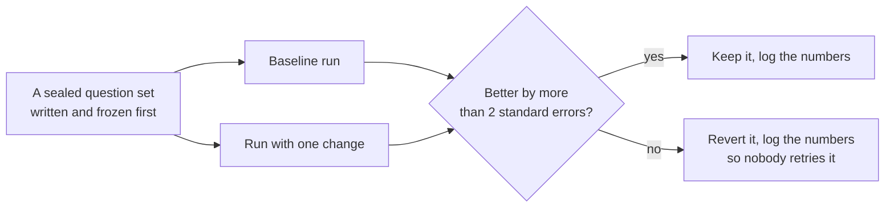
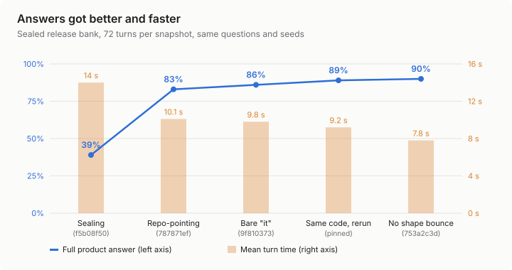
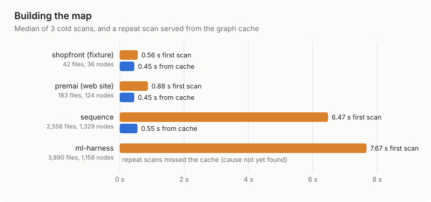
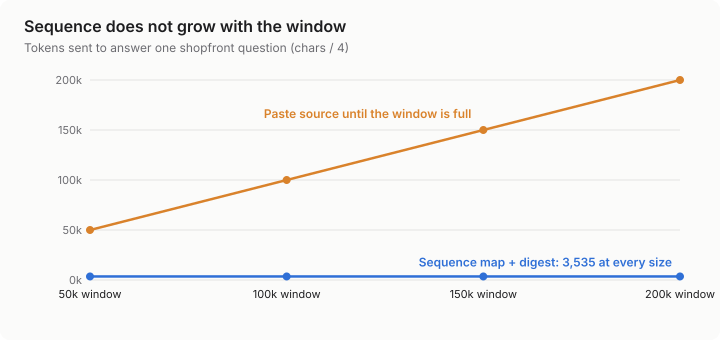
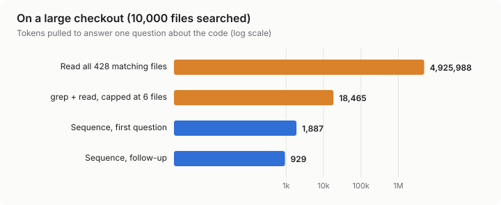
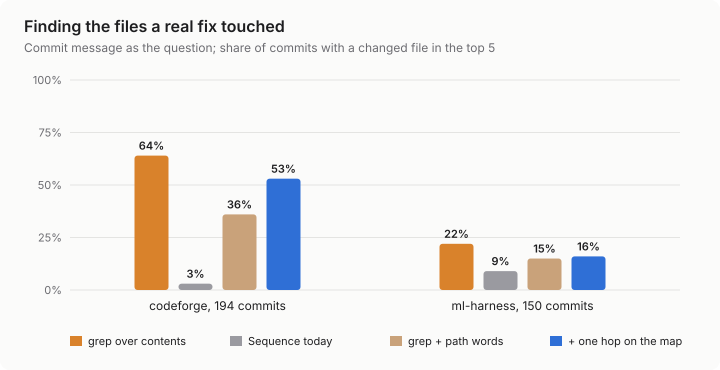
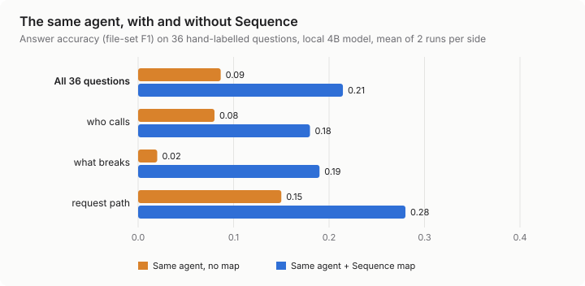

# Sequence, measured

**A field report on the 0.1.3 release: memory, speed, answer quality, drawing, large codebases and finding the right files.**
September 2026. Every number here has a source in [`data.json`](data.json), and every chart is redrawn from it by [`charts.mjs`](charts.mjs).

## In short

Sequence reads a codebase without running it, builds a map of its services, files and connections,
and answers questions from that map with a small local model. Everything here was measured the same
way: change one thing, run it against a sealed set of questions, and keep the change only if it wins
by more than the noise.



What came out of that:

- **Same agent, with and without the map:** accuracy on 36 hand-labelled architecture questions went
  from **0.09 to 0.21** (two runs each side, 2.5 standard errors). It used more tokens to get there.
- **Answers:** full product answers rose from **39% to 90%**, and the average answer took
  **7.8 s instead of 14.0 s**.
- **Cost:** about **3,500 tokens** per question no matter how big the repository is. Reading every
  matching file on this repository would cost **4.9 million**.
- **Accuracy of the map:** **15 of 15** hand-labelled connections found on the reference repository,
  none invented.
- **Downloads:** **4 of 4** builds install and launch on fresh Windows and Mac machines.
- **Weak spot:** Sequence's own file picker finds a file a real fix touched only **3% to 9%** of the
  time, where grep manages 22% to 64%. That is the next fix.

## 1. How we measure

- **Sealed sets.** Question banks are written by a separate worker, frozen with a sha256, and scored once. A set that has been tuned on is spent.
- **Paired A/B.** Baseline and change run on the same questions and seeds. We report baseline, new value, delta, standard error (SE) and n.
- **Keep rule.** A change stays only if it beats the baseline by more than 2 SE on its registered metric and costs nothing elsewhere. Discards are logged, so nobody retries them.
- **Local model, no spend.** Answer turns run on an 8 GB RTX 2060 Super through Ollama, under a lock so one job holds the card. The token and scan benches make no model calls at all.

## 2. Answer quality and speed



The release bank is 36 conversations of two turns, 72 turns per snapshot. A **full product answer** covers what the product is, who it is for, how it works, what it needs and its limits. It is scored by rule, not by a judge.

| Change | Full answers | Turn time | Evidence |
|---|---|---|---|
| Sealing baseline | 39% | 14.0 s | — |
| Treat "this"/"the tool" as a question about the repo | 83% | 10.1 s | +0.19 (SE 0.05) on fresh set 17, 4.0 SE |
| Treat a bare "it" the same way | 86% | 9.8 s | +0.03 (SE 0.04) on the bank; gain held on set 18 |
| Stop sending finished answers back for their shape | 90% | 7.8 s | −1.39 s (SE 0.34), 4.1 SE; calls per turn 1.72 → 1.25 |

**Where the time goes.** A one-call answer costs about 1.9 s plus 21 ms per output token (fit over 64 turns, r = 0.93). Most of the last speed-up came from making fewer calls, not faster ones. Half the turns used to make a second call to reshape an answer that was already complete.

## 3. Memory

Sequence keeps two kinds of memory, and we measured both.

- **The map is remembered.** A scan is cached against the tree. On this repository (2,558 files, 1,329 nodes, 3,499 edges) a first scan takes 6.47 s, and a repeat served from the cache takes 0.55 s, about 12 times faster.
- **The conversation is remembered.** A follow-up does not resend the context the first turn established. On the same question pair, the first turn's prompt is 1,887 tokens and the follow-up's is 929.



**Open:** on ml-harness only 1 of 5 repeat scans hit the cache. We have not found the cause yet, so the chart shows that miss instead of the one fast run.

## 4. Large codebases



The usual way to give an agent a codebase is to fill its context window with source. That cost grows with the window. Sequence sends the relevant slice of the map and a short digest instead, and that cost stays the same size. For one shopfront question it was 3,535 tokens at every window size from 50k to 200k.



On this checkout, the walk stops at 10,000 files, and 428 of them contain the question's words. Reading all 428 costs 4.9 million tokens. A tool that caps itself at six files costs 18,465 and sees only those six. Sequence answers from 1,887 tokens. This repository's own map (1,329 nodes, 3,499 edges) is 23,442 tokens whole, 11.7% of a 200k window. The prompt scoped to one question is 2,818 tokens, 1.4% of that window.

**Buried files.** In the same test, the question's own files were planted in the dump at three depths. The one at about 105k tokens stays out of the window until it reaches 150k. The one at about 400k never enters a 200k window. A reader that fills its window front to back never sees them. Sequence reaches them through the map's edges, not their position in a dump.

## 5. Finding the right files and connections

- **Connections.** On the shopfront reference repository, the map recovers all 15 hand-labelled service connections: HTTP, gRPC, queue and database. That is 100% precision and 100% recall. It also avoids the planted traps, such as a declared dependency that is never used, an external payment API, and generic `/health` routes that must not cross-match. All 11 fixture repositories (microservices, a SPA, React Native, Flutter, a CLI, Kubernetes and Helm) scan with 100% coverage.
- **Files for a question (one clean example).** For "how does orders reach payments and postgres", Sequence pulls six files: the gateway's two routes, the orders payments client, its database module, the payments database module, and the orders event publisher. That is the path the question asks about.
- **Knowing what kind of question it is.** Questions about the product ("who is this for?") need a different answer from questions about code. With repo-pointing on, 22 of 35 detected product questions got a product answer, against 15 of 35 without it. Across four sealed sets, the detector catches 28 of 30, 35 of 40, 33 of 40 and 30 of 40 product questions. It also wrongly flags 1 to 11 code questions per set, and closing that gap is open work.

### Finding the fix in real history

The shopfront result above is one question on a clean repository. To test file-finding on real work, we replayed history. For each of 194 codeforge commits and 150 ml-harness commits, the commit message is the question and the files it changed are the answer. Every picker sees only the code as it was before those commits, so a fix can't give itself away. This was registered in the lab log before it ran.



| Picker | codeforge | ml-harness |
|---|---|---|
| grep over file contents | **64%** | **22%** |
| Sequence's file picker today | 3% | 9% |
| grep plus Sequence's path words | 36% | 15% |
| the same plus one hop on the map | 53% | 16% |

This is the weakest result in the report, and we are leaving it in.

- **Sequence's own file picker is poor on real history.** It scores path names only, and it has no stopword list, so the word "the" matches every `*Theme*` file.
- **The map's connections help a weak ranker on codeforge.** One hop adds 16.5 points (5.0 SE), but it adds nothing on ml-harness and never beats plain grep, so it was discarded.
- **Next:** stopwords and content scoring inside Sequence's picker, scored on this same bench, with grep as the bar to beat.

## 6. The same agent, with and without Sequence

This is the comparison that matters: one agent, one model, the same questions, run twice, once plain and once with Sequence's map attached as a command. Nothing else changes.



- **Set.** 36 questions across shopfront, ml-harness and premai: "who calls X", "what breaks if I change X", and "how does a request get from A to B". A separate worker labelled every answer from the source code without ever running Sequence, and the set was frozen (sha256 `cdbd6fa7`) before either arm ran.
- **Agent.** A minimal bash agent in the style of mini-swe-agent, on qwen3.5:4b running locally through Ollama. It costs $0 and nothing leaves the machine. Both arms are read-only and blocked from Sequence's cache folder. The Sequence arm adds one command, `sequence-map who_calls | impact | path_between`.
- **Codex** was the first choice, but its own prompt overflows a 4B model's 32k context: 0 tool calls on the first try. It also cannot load a locally built 64k variant. It needs a larger model than this card holds.

| | Same agent, no map | Same agent + Sequence |
|---|---|---|
| Answer accuracy (F1), run 1 / run 2 | 0.082 / 0.091 | **0.238 / 0.191** |
| Exact answers, run 1 / run 2 | 1 / 1 of 36 | 2 / 5 of 36 |
| Commands per question | 1.2 / 1.3 | 3.8 / 3.6 |
| Tokens per question | 1,158 / 2,328 | 6,789 / 9,152 |
| Seconds per question | 4.0 / 2.7 | 7.8 / 6.9 |

**Result: the map wins.** F1 rises by 0.128 per question (SE 0.051, 2.5 SE, n = 36), and both Sequence runs score above both plain runs. That meets the bar registered before the run. The gain is largest on "what breaks" (0.02 → 0.19) and on ml-harness (0.08 → 0.37).

**What it costs, and what it does not show:**
- The Sequence arm used more tokens and time. The plain agent mostly gave up after one command. The map gave the small model something it could act on, so it kept working.
- On shopfront there was no gain (0.09 → 0.07), even though the map itself scores 15 of 15 there. The model did not turn the map's answer into the file list.
- Absolute scores are low because the model is small. This shows the map helping a weak agent, not a strong one.

### How this compares with published work

No published test matches ours exactly: theirs use issue text on SWE-bench-style data, ours uses architecture questions and commit messages on our repositories. These are the nearest reference points.

| Published result | Source | What it says about us |
|---|---|---|
| BM25 keyword search finds a changed file in the top 5 on 61.7% of SWE-bench Lite issues | LocAgent, ACL 2025, Table 4 | Our grep baseline (64% / 22%) sits in the normal range for keyword search. |
| BM25 over file paths only reaches 28.4% Hit@5 on SWE-bench Verified; over file contents, 67.6% | arXiv 2607.11046 (preprint), Table 2 | Our file picker scores paths only, which is why it sits at 3–9%. Contents are the fix. |
| Adding a repository graph raises file localization by +5.6 points (Agentless and SWE-agent with GPT-4o) | RepoGraph, ICLR 2025, Table 3 | Graphs help most as an addition to keyword search. Our one-hop test agrees: it lifted a weak ranker, not grep. |
| Removing graph traversal from LocAgent costs 2.2 points Acc@5; removing keyword search costs 13–19 | LocAgent, ACL 2025, Table 6 | Same lesson: search does the heavy lifting on localization. |
| A code graph served over MCP answered with 0.83 quality against 0.92 for grep and file reading, at about 10× fewer tokens | Codebase-Memory, arXiv 2603.27277 (preprint), Table 6 | The opposite trade from ours: there the graph saved tokens and lost accuracy. Here, with a small model, it gained accuracy and spent tokens. |

## 7. Drawing

Sequence draws a flow chart for most answers. We tested what the picture should carry, and judged it on screenshots of what the canvas actually draws.

| Change | Result | Kept? |
|---|---|---|
| Name each hop in the chart | Picture carries the answer: 40 wins, 0 losses, 15 ties over 55 pairs (+12 SE) | Kept |
| Write the hops into the caption | Helps the question: 21 of 21 judgements, 7 of 7 items unanimous (p = 1/128) | Kept, on by default |
| Fit the chart to the frame's real width | Cut labels at 900 px fell from 6 to 4; 0 overlaps in 60 renders | Kept, on by default |
| Draw in Graphviz DOT instead of JSON | Flow charts fell from 60% to 43% | Discarded |

## 8. Downloads

| Platform | Build | Downloaded, checksum, installed, launched |
|---|---|---|
| Windows | Installer | Pass |
| Windows | Portable zip | Pass |
| macOS, Apple silicon | Disk image | Pass |
| macOS, Intel | Disk image | Pass |

Each row is a fresh GitHub machine that read the links from [trysequence.app](https://trysequence.app), downloaded the build, checked it against `SHASUMS256.txt`, installed it, and launched it to the app's first screen. The Mac builds are ad-hoc signed and not notarized, so the first launch on a real Mac needs one visit to **Privacy & Security → Open Anyway**. Rerun it from the Actions tab with the **Download smoke** workflow.

## 9. What did not work

| Tried | Result |
|---|---|
| llama-server in place of Ollama | 12 of 21 turns leaked tool-call text; quality −17.5 (SE 4.0). Discarded. |
| Replace the question patterns with a small classifier | False code hits 5 → 0, but recall fell 30 → 27 of 40. Discarded. |
| Drop the structure digest from product turns | No effect on any metric. Discarded. |
| Strip closing quiz questions | No change (18.8% → 18.8%). Discarded. |
| DOT as the drawing language | See §7. Discarded. |
| Skip common words in the file picker | +1 point on find the fix (1.6 SE). Discarded. |
| One hop on the map to find a fix | Lifted a weak ranker 16.5 points, never beat grep. Discarded. |

## 10. Limits

- Answer quality is scored by rule on one sealed bank, with a small local model. A larger model would score differently.
- Token counts are characters ÷ 4, not a real tokenizer.
- The token saving is for questions that span several files. On a one-hop lookup, grep is not more expensive, and we do not claim it is.
- Connection accuracy is ground-truthed on one repository with 15 labelled edges. The other fixtures check coverage, not correctness.
- Scan times come from one Windows machine.

## Reproduce

```bash
node tools/bench/agent-context-bench.mjs --json   # tokens: no model, no key
node packages/analyzer/dist/cli.js scan <repo> --no-cache --out map.json
node packages/analyzer/dist/eval/grade.js          # connections vs ground truth
node tools/release/download-smoke.mjs              # download and launch from the site
node tools/bench/find-the-fix.mjs --repo .         # replay history: find the files each commit touched
node tools/bench/agent-ab/run.mjs --questions tools/bench/agent-ab/sets/arch-questions-v1.json --repos <repos.json> --agent bash --model qwen3.5:4b --arm plain|sequence
node report/charts.mjs                             # redraw these charts from data.json
```
